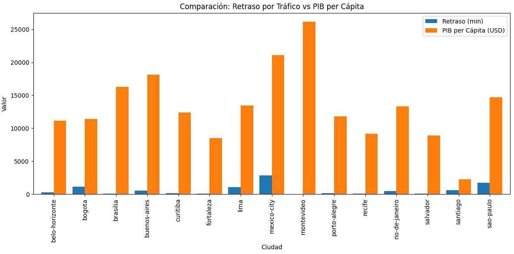

# Urban Mobility & Economic Productivity Analysis

## 📋 Project Overview
This project investigates the macroeconomic impact of urban traffic congestion on economic productivity across major global cities. By analyzing transit delays alongside localized financial metrics, the study aims to quantify the hidden economic costs of mobility inefficiencies and assist development banks in prioritizing infrastructure investments.

## 🛠️ Tech Stack & Methodologies
* **Language:** Python
* **Libraries:** Pandas (Data Wrangling & Cleaning), NumPy (Numerical Operations), Matplotlib & Seaborn (Exploratory Data Analysis & Visualizations)
* **Core Skills:** Statistical Analysis, Advanced Data Aggregation, Structural Dataset Merging (INNER JOINs), Outlier Detection.

---

## 🧾 Executive Summary

**Context & Objective:** This analysis evaluates the relationship between urban mobility—measured through congestion delays (`jams_delay`)—and economic productivity, represented by GDP per capita. The objective is to identify critical inefficiencies where vehicular traffic acts as a barrier to economic development, enabling development institutions to prioritize transportation infrastructure investments that maximize social welfare and productive efficiency.

**Data Coverage:** Integrated traffic data from the TomTom Traffic Index and economic indicators from OECD Cities for the year 2024, covering 15 major Latin American cities (including metropolitan areas in Argentina, Brazil, Chile, Colombia, and Mexico).

**Methodology (High-Level):** The workflow involved standardizing city names, cleaning regional numerical formats, and performing an `INNER JOIN` to ensure data integrity across sources. Boxplots were applied to detect congestion outliers, and distribution analyses were performed on GDP metrics.

**Key Findings:** * **Regional Bottlenecks:** The regional average stood at 629.52 minutes of delay, with an extreme outlier exceeding 2,500 minutes, highlighting severe localized mobility crises.
* **Wealth vs. Fluidity Decoupling:** Highly productive cities do not necessarily suffer from high congestion, proving that efficient infrastructure is achievable. However, a specific cluster of cities exhibits a disproportionate amount of time lost in traffic relative to their wealth generation.
* **Critical Hotspots:** While Mexico City registers the highest absolute congestion, **Bogotá and Lima emerge as the most critical nodes** when evaluating the "lost time vs. productivity" ratio. Bogotá, in particular, displays congestion levels that rival major economic powerhouses despite maintaining a moderate GDP per capita.

**Strategic Recommendations:** * **Targeted High-Impact Investment:** Direct mass transit infrastructure and smart traffic management funds toward **Bogotá and Mexico City**, as these are the primary points where the "congestion cost" heavily drags down economic growth potential.
* **Benchmarking "Intermediate Efficiency" Cities:** Cities like **Montevideo and Brasilia** present high GDP levels alongside remarkably low or well-controlled congestion. It is highly recommended to perform a benchmarking study on these markets. They do not require massive overhaul overhauls, but rather preservation and micro-mobility projects (bike lanes, electric transit) to ensure future growth does not compromise their current mobility efficiency. *It is far more cost-effective to maintain a fluid city than to repair a collapsed one.*

---

## 📈 Visualizations
Here is the core chart showcasing the correlation between traffic delays and wealth distribution across the analyzed regions:

